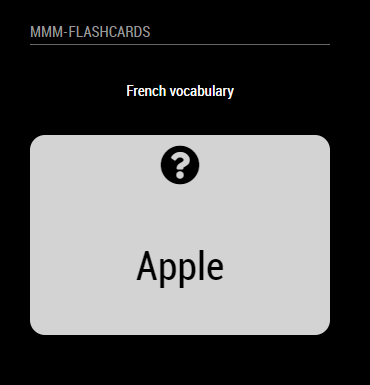
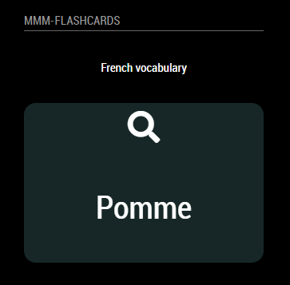

# MMM-Flashcards
A [MagicMirror](https://magicmirror.builders) module for learning with Flashcards method.
You can configure the number of buckets of the [Leitner system](https://en.wikipedia.org) to use.
You can configure a coefficient to define how less frequent a card from a bucket to another will appear.
You can load as many collections of flashcards as you want by providing the list of questions/answers in the config file of the module.

This module is integrated with [MMM-KeyBindings](https://github.com/shbatm/MMM-KeyBindings) for keyboard control.


## About the Leitner System
From the [Wikipedia page](http://en.wikipedia.org/wiki/Leitner_system): 

The Leitner system is a widely used method to efficiently use flashcards that was proposed by the German science journalist Sebastian Leitner in the 1970s. __It is a simple implementation of the principle of spaced repetition, where cards are reviewed at increasing interval.__

In this method flashcards are sorted into groups according to how well you know each one in the Leitner's learning box. This is how it works: you try to recall the solution written on a flashcard. If you succeed, you send the card to the next group. But if you fail, you send it back to the first group. __Each succeeding group has a longer period of time before you are required to revisit the cards.__

 
## Screenshots






## Installation

In your terminal, go to your MagicMirror's Module folder:
````
cd ~/MagicMirror/modules
````

Clone this repository:
````
git clone https://github.com/dixyz/MMM-Flashcards.git
````

Add the module to the modules array in the `config/config.js` file:
````javascript
  {
    module: 'MMM-Flashcards',
	position: "top_left",

  },
````

## Configuration options

The following properties can be configured:


| Option                       | Description
| ---------------------------- | -----------
| `header`                     | The header text <br><br> **Default value:** `'MMM-Flashcards'`
| `nbBuckets`                  | Number of buckets to use **Default value:** `4`
| `step`                       | Coefficient between 2 buckets. The higher the less frequent **Default value:** `3`
| `topics`                     | Array of topics. See config below.
| `fadeSpeed`                  | Fade speed in ms <br> **Default value:** `1000`

## Topics config
````javascript
    topics:[
        {
            name: "topic's name",            //Name of the topic
            cards: [                         //Array of objects (question / answer)
                {
                    question: "Question",    //Question 
                    answer: "Answer"         //Answer to the queestion
                }
            ]
        },

    ]
````


## Config Example

````javascript
    {
      module: 'MMM-Flashcards',
      position: "top_left",
      config : {
		header: "MMM-Flashcards",
		fadeSpeed: 1000,
		nbBuckets: 4,
		step: 3,
		topics: [
			{
				name: "Learning addition",
				cards: [
					{
						question: "1 + 1",
						answer: "2"
					},
					{
						question: "2 + 2",
						answer: "4"
					},

				]
			},

			{
				name: "French vocabulary",
				cards: [
					{
						question: "Apple",
						answer: "Pomme"
					},
					{
						question: "To learn",
						answer: "Apprendre"
					},
					{
						question: "Vocabulary",
						answer: "Vocabulaire"
					},


				]
			},	
		], 
      }
    },
````

## KeyBindings Config
The default configuration for MMM-KeyBindings is below. This can be customized by adding to the normal module config.

````javascript
    keyBindings: {
        enabled: true,
        mode: "DEFAULT",
        map: {
            correct: "ArrowRight",    //The answer is correctly done
            wrong: "ArrowLeft",       //The answer is not correct
            flip: "Home",             //Flip the flashcard (show answer/question)
            prevTopic: "ArrowUp",     //Change topic
            nextTopic: "ArrowDown",   //Change topic
        }
    }
````

## Navigation

| Key                          | Description
| ---------------------------- | -----------
| `ArrowRight`                 | The learner gives the correct answer. The flashcard is promoted to the next bucket.
| `ArrowDown`                  | The learner fails to give the correct answer. The flashcard is moved back to the first bucket.
| `Home`                       | Flip the flashcard to show the answer or question.
| `ArrowUp`                    | Load previous topic in the list
| `ArrowDown`                  | Load next topic in the list


